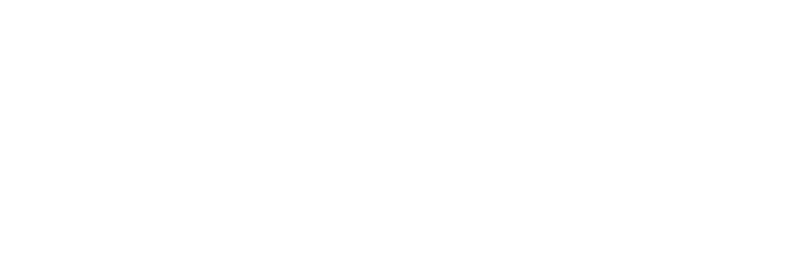

<div align="center">

# `T H E   T W I N   T R E E S`

### **עץ החיים · קליפות**

*Etz Chaim & Qliphoth — United Through Da'at*

---

**[ [Live Demo](https://twin-trees.pages.dev) ]**

---



---

</div>

```
                        K E T H E R
                       ╱     |     ╲
                 Chokmah ----+---- Binah
                   ╲   ╲    |    ╱   ╱
                    ╲   ╲   |   ╱   ╱
                     ╲   D A ' A T  ╱        ← The Abyss
                      ╲     |     ╱
                 Chesed ----+---- Geburah
                   ╲   ╲    |    ╱   ╱
                    ╲   Tiphareth   ╱
                     ╲  ╱   |   ╲  ╱
                 Netzach ---+--- Hod
                       ╲    |    ╱
                        Y E S O D
                            |
                       M A L K U T H

         ─────────────────────────────────
                    ║ DA'AT ║
                    ║ ABYSS ║
         ─────────────────────────────────

                      L I L I T H
                            |
                       GAMALIEL
                       ╱    |    ╲
                 Samael ---+--- A'arab Zaraq
                    ╱   Thagirion   ╲
                   ╱   ╱    |    ╲   ╲
                 Golachab --+-- Gha'agsheklah
                      ╲     |     ╱
                     S A T A R I E L
                       ╲    |    ╱
                 Ghogiel ---+--- Satariel
                       ╲    |    ╱
                     T H A U M I E L
```

<div align="center">

*A real-time interactive 3D visualization of the complete Kabbalistic dual-tree system.*
*Two trees. One abyss. Twenty-two paths. Rendered in WebGL.*

---

</div>

## The Vision

> *"The Qliphoth are not the opposite of the Sephiroth — they are their shells, their shadows, the husks that remain when the light withdraws."*

Traditional diagrams flatten these structures onto paper. This project renders them as they were meant to be understood: **in three dimensions** — two flat planes stacked like pancakes with space between them, Da'at floating in the Abyss as the gateway connecting both realms.

The Tree of Life emanates downward from Kether (Crown) through ten spheres of divine light. Directly below it, separated by the Abyss, the Tree of Death mirrors each sphere with its shadow — the Qliphoth, the broken vessels. Between them, Da'at — the invisible sephira of Knowledge — serves as the singular bridge.

---

## Architecture

```
┌─────────────────────────────────────────────────────┐
│                                                     │
│   ┌───────────────────────────────┐                 │
│   │     TREE OF LIFE  (y = +5)    │  ← Upper Plane  │
│   │  10 Sephiroth · Golden Paths  │                 │
│   └───────────────┬───────────────┘                 │
│                   │                                 │
│              ╔════╧════╗                            │
│              ║  DA'AT  ║  ← y = 0 · The Abyss      │
│              ║ Gateway ║                            │
│              ╚════╤════╝                            │
│                   │                                 │
│   ┌───────────────┴───────────────┐                 │
│   │    TREE OF DEATH  (y = -5)    │  ← Lower Plane  │
│   │  10 Qliphoth · Crimson Tunnels│                 │
│   └───────────────────────────────┘                 │
│                                                     │
│            Starfield Background · Bloom             │
└─────────────────────────────────────────────────────┘
```

---

## Features

<table>
<tr>
<td width="50%">

### Sephiroth & Qliphoth
Each of the **20 spheres** is interactive — click to reveal:
- Hebrew name and glyph
- English translation
- Divine Name / Demonic Ruler
- Archangel / Archdevil
- Kabbalistic World (Atziluth → Assiah)
- Descriptive text from tradition

</td>
<td width="50%">

### 22 Paths of Wisdom
Every path between sephiroth carries meaning:
- **Hebrew letter** and pronunciation
- **English meaning** (Ox, House, Camel...)
- **Tarot Major Arcana** correspondence
- **Element or Zodiac** attribution
- **Connection endpoints** (which spheres it bridges)

</td>
</tr>
<tr>
<td>

### Da'at — The Abyss
The hidden 11th sephira rendered as:
- Pulsing **torus rings** at the gateway
- **Energy tunnels** connecting both tree planes
- Particle field in the void between worlds
- Correctly positioned per the Zohar: *below* Chokmah/Binah, *above* Chesed/Geburah

</td>
<td>

### Sacred Overlays
Toggle additional mystical geometry:
- **Metatron's Cube** wireframe overlay
- **Lightning Flash** — animated bolt tracing the path of emanation (1→2→3→...→10)
- **Four Worlds** labels along the vertical axis
- **Bloom post-processing** for ethereal glow

</td>
</tr>
</table>

### Layout & Controls

| Control | Action |
|:---|:---|
| `Left Drag` | Orbit camera around the scene |
| `Right Drag` | Pan the viewport |
| `Scroll` | Zoom in and out |
| `Click Sphere` | Open info panel for that sephira or qlipha |
| `Click Path` | Show Hebrew letter, Tarot card, element |
| `Vertical / Horizontal` | Toggle tree orientation with smooth animation |
| `Auto Rotate` | Continuous slow rotation for presentation |

---

## The Ten Sephiroth

```
 #   Name          Translation        Pillar       World
─── ─────────────  ─────────────────  ───────────  ──────────
 1   Kether        Crown              Middle       Atziluth
 2   Chokmah       Wisdom             Mercy        Atziluth
 3   Binah         Understanding      Severity     Briah
 4   Chesed        Mercy              Mercy        Briah
 5   Geburah       Strength           Severity     Yetzirah
 6   Tiphareth     Beauty             Middle       Yetzirah
 7   Netzach       Victory            Mercy        Yetzirah
 8   Hod           Splendour          Severity     Yetzirah
 9   Yesod         Foundation         Middle       Yetzirah
10   Malkuth       Kingdom            Middle       Assiah
     Da'at         Knowledge          Middle       The Abyss
```

## The Ten Qliphoth

```
 #   Name            Translation          Demon
─── ───────────────  ───────────────────  ──────────────────
 1   Thaumiel        Twin Gods            Satan / Moloch
 2   Ghogiel         The Hinderers        Beelzebub
 3   Satariel        The Concealers       Lucifuge Rofocale
 4   Gha'agsheklah   The Devourers        Astaroth
 5   Golachab        The Burners          Asmodeus
 6   Thagirion       The Disputers        Belphegor
 7   A'arab Zaraq    Ravens of Dispersion Baal
 8   Samael          Poison of God        Adrammelech
 9   Gamaliel        The Obscene Ones     Lilith
10   Lilith          The Whisperers       Naamah
```

## The 22 Paths

```
 Path   Letter    Name      Meaning         Tarot                 Attribution
────── ──────── ────────  ──────────────  ────────────────────── ────────────
 11     א        Aleph     Ox              The Fool               Air
 12     ב        Beth      House           The Magician           Mercury
 13     ג        Gimel     Camel           High Priestess         Moon
 14     ד        Daleth    Door            The Empress            Venus
 15     ה        Heh       Window          The Emperor            Aries
 16     ו        Vav       Nail            Hierophant             Taurus
 17     ז        Zayin     Sword           The Lovers             Gemini
 18     ח        Cheth     Fence           The Chariot            Cancer
 19     ט        Teth      Serpent         Strength               Leo
 20     י        Yod       Hand            The Hermit             Virgo
 21     כ        Kaph      Palm            Wheel of Fortune       Jupiter
 22     ל        Lamed     Ox Goad         Justice                Libra
 23     מ        Mem       Water           Hanged Man             Water
 24     נ        Nun       Fish            Death                  Scorpio
 25     ס        Samekh    Prop            Temperance             Sagittarius
 26     ע        Ayin      Eye             The Devil              Capricorn
 27     פ        Peh       Mouth           The Tower              Mars
 28     צ        Tzaddi    Fishhook        The Star               Aquarius
 29     ק        Qoph      Back of Head    The Moon               Pisces
 30     ר        Resh      Head            The Sun                Sun
 31     ש        Shin      Tooth           Judgement              Fire
 32     ת        Tav       Cross           The World              Saturn
```

---

## Kabbalistic Sources

The visualization follows established traditions:

| Aspect | Source |
|:---|:---|
| Sephiroth positions | Three-pillar layout (Severity · Mildness · Mercy) |
| Da'at placement | Zohar, Lurianic Kabbalah — in the Abyss between Supernals and lower 7 |
| Qliphoth structure | Hermetic Qabalah — same pillar layout as sephirotic mirrors |
| Path correspondences | Golden Dawn tradition — Hebrew alphabet to Tarot mapping |
| Divine/Angelic names | Hermetic Qabalah, Sefer Yetzirah, Bahir |
| Demonic attributions | Liber 777 (Aleister Crowley), S.L. MacGregor Mathers |
| 3D pancake model | Oral tradition — "think of it in 3D, not on paper" |

---

## Tech

```
Three.js r164          3D scene graph and WebGL rendering
UnrealBloomPass        Post-processing ethereal glow
OrbitControls          Camera orbit, pan, zoom
EffectComposer         Multi-pass render pipeline
Vanilla JS             Zero build step, zero dependencies
Single HTML file       Entire app in one index.html
Cloudflare Pages       Edge-deployed globally
```

---

## Run Locally

```bash
# No install needed — just serve
npx serve .

# Or with Python
python -m http.server 8080
```

Open `http://localhost:8080` in any modern browser.

## Deploy

```bash
npx wrangler pages deploy . --project-name=twin-trees
```

---

<div align="center">

## **[ [Enter the Abyss](https://twin-trees.pages.dev) ]**

---

```
       "As above, so below.
        As within, so without.
        As the universe, so the soul."

                    — The Emerald Tablet
```

---

MIT License

*Built with Three.js and ancient wisdom.*

</div>
